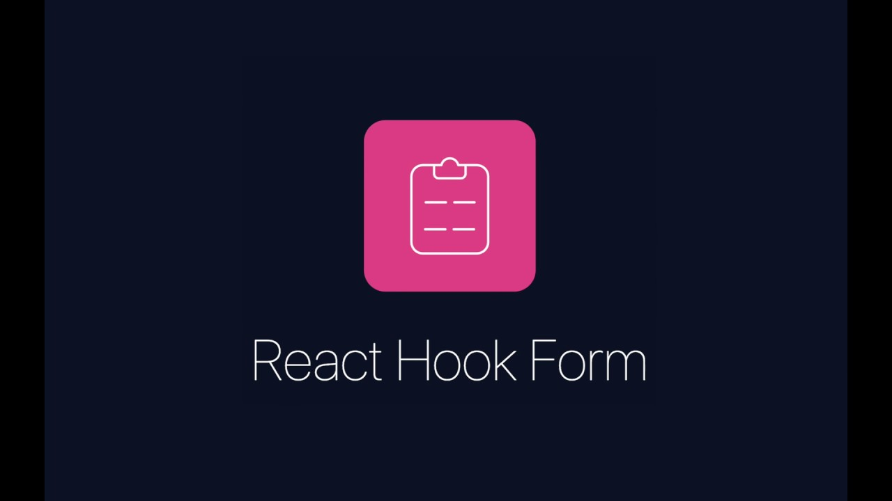

<p align="center">
  
   <a href="./LICENCE" alt="licence">
      
   </a>
 
   <a href="https://www.linkedin.com/in/meetpatel-professional/" alt="meetpatel-linkedin">
      
   </a>
 
   <a href="https://twitter.com/___meetpatel___" alt="meetpatel-twitter">
      
   </a>
   
   <a href="https://github.com/mpmeetpatel/dropify/issues" alt="Contributors">
      
   </a>
 
</p>


<!-- PROJECT LOGO -->
<br />
<p align="center">
  <a href="#">
    
  </a>

  <h3 align="center"><b>Dropify</b>  </h3>
  <h3 align="center">An audio and video assets selling marketplace </h3>
  <h3 align="center">The mini amazon for audio/video creators :)</h3>

  <p align="center">
    <!-- <a href="#"><strong>Explore the docs »</strong></a> -->
    <!-- <a href="#">View Demo</a> -->
    ·
    <a href="https://github.com/mpmeetpatel/dropify/issues">Report Bug</a>
    ·
    <a href="https://github.com/mpmeetpatel/dropify/issues">Request Feature</a>
    ·
  </p>
</p>

<!-- TABLE OF CONTENTS -->
<details open="open">
  <summary>Table of Contents</summary>
  <ol>
    <li>
      <a href="#about-the-project">About The Project</a>
      <ul>
        <li><a href="#built-with">Built With</a></li>
      </ul>
      <ul>
        <li><a href="#features">Features</a></li>
      </ul>
    </li>
    <li>
      <a href="#getting-started">Getting Started</a>
      <ul>
        <li><a href="#prerequisites">Prerequisites</a></li>
        <li><a href="#installation">Installation</a></li>
      </ul>
    </li>
    <li><a href="#usage">Usage</a></li>
    <li><a href="#roadmap">Roadmap</a></li>
    <li><a href="#contributing">Contributing</a></li>
    <li><a href="#license">License</a></li>
    <li><a href="#contact">Contact</a></li>
  </ol>
</details>

<!-- ABOUT THE PROJECT -->

## About The Project:

[![Product Name Screen Shot][product-screenshot]](#)

- This is a marketplace for selling audio/video assets online. By default, it's configured to use Indian(INR) currency but you can customize it for your country as well. The main goal of this project is to combine all JavaScript and TypeScript tooling and other system design to create a scalable product from scratch. Also, this project will be a solid base for all my future products. In future this will be production ready product, currently it's in development mode and will be improved soon :) 
- However a lot of major features are implemented and a list can be found in the <b><a href="#features">Features</a></b> section.

## Product preview :)

  <div style="text-align: center">
    
  </div>
  <br />

### Built With

  <p align="center">
    
  </p>
  <br />
  <p align="center">
    
  </p>
  <br />
  <p align="center">
    
  </p>
  <br />
  <p align="center">
    
  </p>
  <br />
  <p align="center">
    
  </p>
  <br />
  <p align="center">
    
  </p>
  <br />
  <p align="center">
    
  </p>
  <br />
  <p align="center">
    
  </p>
  <br />
  <p align="center">
    
  </p>
  <br />


## Architecture

- Microservice + Async Communication
                                  
## OS                             
- Linux Based (Personal choice and for ease of development)                       
                                  
## FrontEnd                             
                                  
- NextJS                            
- TailwindCSS                       
- React-Dropzone                    
- React-Hook-Form                   
- WebRTC MediaStreamAPI             
- Plyr                              
                                  
## BackEnd                             
                                  
- NodeJS                            
- Express                           
- TypeScript                        
- MongoDB                           
- Mongoose                          
- RabbitMQ                          
- Argon2                            
- Cors                              
- express-rate-limit                
- Nodemailer                        
                                  
<!-- FEATURES -->

## features:


<h3 align="left"> ️🤝 Implemented / Ongoing (PR welcome) 🤝 </h3>

|                Feature                            |  🔰      Done        | 
| ------------------------------------------------- |  :----------------   | 
| Independent Microservices                         |         ✔️         |
| Async Microservices communication (RabbitMQ)      |         ✔️         |
| Kubernetes Cluster                                |         ✔️         |
| Docker Images                                     |         ✔️         |
| ES6+ and TypeScript                               |         ✔️         |
| Mongoose and CRUD                                 |         ✔️         |
| WebRTC Audio/Video Recorder                       |         ✔️         |
| Live Audio/Video Previwer                         |         ✔️         |
| Stripe Onboarding (By default INR currency)       |         ✔️         |
| Stripe Checkouts                                  |         ✔️         |
| Stripe Balance                                    |         ✔️         |
| Scalable Database Schema                          |         ✔️         |
| Role Based Authentication (if needed)             |         ✔️         |
| SignUp + SignIn (JWT)                             |         ✔️         |
| Forgot Password                                   |         ✔️         |
| Reset Password                                    |         ✔️         |
| Mail Send (mailtrap currently)                    |         ✔️         |
| Global Error Catch                                |         ✔️         |
| Sorting (if needed)                               |         ✔️         |
| Limit fields                                      |         ✔️         |
| Pagination (both front and back)                  |         ✔️         |
| File Upload (using cloudinary)                    |         ✔️         |
| Streaming of audio/video (Plyr)                   |         ✔️         |
| NextJS Routing + SSR                              |         ✔️         |
| NextJS Demo Cloud function                        |         ✔️         |
| TailwindCSS (Responsive)                          |         ✔️         |
| Streaming of audio/video (Plyr)                   |         ✔️         |
| Global Search (like elastic/algolia search)       |         ❌         |
| Kubernetes Cloud Hosting Guide                    |         ❌         |
| Reports                                           |         ❌         |
| Analytics of platform                             |         ❌         |
| Sharding + ReplicaSets Mongo                      |         ❌         |
| RabbitMQ with persitence storage(Currently using in-memory store)                                              |         ❌         |

<!-- GETTING STARTED -->

## Getting Started

- Project is not deployed live yet, because currently it's in alpha version and once production ready version out, live URL will be added.

### Prerequisites

- Before you proceed, Above tech stack is used to build this platform, basic understanding of each tech is required.

</br>

### Installation

<b>1. Clone the repo</b>

```sh
git clone --recursive https://github.com/mpmeetpatel/dropify.git
```

<b>2. Configure and prepare your local environment (I'm on linux), follow command and guide</b>
(Some setup you've to google it based on your Operating System)
- 2.1
(for windows/mac follow minikube installation guide from docs)
  - 2.1.1
    Install KVM (If not present)
    https://computingforgeeks.com/install-kvm-centos-rhel-ubuntu-debian-sles-arch/

  ```sh
  sudo apt-get -y install qemu-kvm libvirt-bin virt-top  libguestfs-tools virtinst bridge-utils
  ```

  ```sh
  sudo modprobe vhost_net
  ```

  ```sh
  sudo lsmod | grep vhost
  ```

  ```sh
  echo "vhost_net" | sudo tee -a /etc/modules
  ```

  ```sh
    sudo apt-get update
  ```

  ```sh
    sudo apt-get install apt-transport-https
  ```

  ```sh
    sudo apt-get upgrade
  ```

  - 2.1.2
    Install minikube (If not present)
    https://minikube.sigs.k8s.io/docs/start/

  Debian based (ubuntu/mint)

  ```sh
    curl -LO https://storage.googleapis.com/minikube/releases/latest/minikube_latest_amd64.deb
  ```

  ```sh
    sudo dpkg -i minikube_latest_amd64.deb
  ```

  ```sh
    minikube version
  ```

  ```sh
    minikube config set driver kvm2
  ```

  (minimum 2 cpu, recommended 4)

  ```sh
    minikube config set cpus 4
  ```

  (minimum 4096 memory, recommended 8192)

  ```sh
    minikube config set memory 8192
  ```

<b>2.2 Configure minikube(kuberneted cluster) with NFS</b>

- 2.2.1 Check and configure minikube

  ```sh
    minikube config view
  ```

  ```sh
    minikube version
  ```

  <div style="text-align: center">
    
  </div>
  <br />

  ```sh
    minikube addons enable registry
  ```

  ```sh
    minikube addons enable ingress
  ```

  ```sh
    minikube addons enable ingress-dns
  ```

  ```sh
    minikube addons enable storage-provisioner
  ```

  ```sh
    minikube addon list
  ```

  <div style="text-align: center">
    
  </div>
  <br />

  ```sh
    minikube start
  ```

  <div style="text-align: center">
    
  </div>
  <br />

  ```sh
    kubectl version --short
  ```

  <div style="text-align: center">
    
  </div>

- 2.2.2 configure storage for kubernetes( We will use NFS locally :- )
  <br />

  ```sh
    sudo apt install nfs-kernel-server
  ```

  ```sh
    sudo systemctl enable nfs-server
  ```

  ```sh
    sudo systemctl status nfs-server
  ```

  ```sh
    cd ~
  ```

  ```sh
    sudo mkdir /nfs
  ```

  ```sh
    sudo chmod 777 /nfs
  ```

  ```sh
    sudo nano /etc/exports
  ```

  add below line and save the file

  ```sh
    /nfs    *(rw,sync,no_root_squash,no_subtree_check,insecure)
  ```

  ```sh
    sudo exportfs -rav
  ```

  ```sh
    sudo exportfs -rav
  ```

  ```sh
    sudo showmount -e
  ```

    <div style="text-align: center">
      
    </div>
    <br/>

- 2.2.3 configure NFS folder

  ```sh
    cd ~
  ```

  ```sh
    cd /nfs
  ```

  ```sh
    mkdir auth
  ```

  ```sh
    mkdir dropin
  ```

  ```sh
    mkdir order
  ```

  ```sh
    mkdir payment
  ```

  ```sh
    ls
  ```

  <div style="text-align: center">
    
  </div>
  <br />

- 2.2.4 Go to your cloned repo folder

  ```sh
    cd <your cloned repo folder path>
  ```

  <div style="text-align: center">
    
  </div>

- 2.2.5 Prepare host with dns

  ```sh
    minikube ip
  ```

  (grab the minikube ip (kubernetes cluster ip))

  <div style="text-align: center">
    
  </div>
  <br />

  ```sh
    sudo nano /etc/hosts
  ```

  (add 192.168.39.144 (Your minikube ip) and map it dropify.dev -> see below image second line -> then save the file)

  <div style="text-align: center">
    
  </div>
  <br />

- 2.2.6 Prepare project with dependencies

  ```sh
    cd <your cloned repo folder>
  ```

  ```sh
    cd pv
  ```

  ```sh
    kubectl apply -f .
  ```

  (The above thing have to do one time)

  <div style="text-align: center">
    
  </div>
  <br />

  ```sh
    cd ..
  ```

  (go back to root of our project folder)

<b>3. Setup Skaffold and Docker</b>

- 3.1 Install Skaffold

  ```sh
  curl -Lo skaffold https://storage.googleapis.com/skaffold/releases/latest/skaffold-linux-amd64 && \
  sudo install skaffold /usr/local/bin/
  ```

  (For Linux AMD64 -> AMD, Intel)

  ```sh
  curl -Lo skaffold https://storage.googleapis.com/skaffold/releases/latest/skaffold-linux-arm64 && \
  sudo install skaffold /usr/local/bin/
  ```

  (For Linux ARM64 -> ChromeBook, New MacBooks (Apple M1 Chip))

- 3.2 Install Docker

  ```sh
    sudo apt-get update
  ```

  ```sh
    sudo apt-get install docker-ce docker-ce-cli containerd.io
  ```

  ```sh
    docker version
  ```

  (For Mac, Windows -> Please refer official docs)

<b>4. Start Kubernetes cluster </b>

```sh
  minikube start
```

```sh
  minikube status
```

```
  npm start
```

(In your root cloned repo folder)

<b>5. Enter your env variables in `.env` of "dropify-client" folder</b>
<br />

```sh
  cd dropify-client
```

- Add below env variables (Create .env file if don't exists)

```ENV
 NEXT_PUBLIC_BASE_URL = https://dropify.dev

 NEXT_PUBLIC_CLOUDNARY_UPLOAD_URL = <your cloudnary upload url>

 NEXT_PUBLIC_CLOUDNARY_API_KEY = <your cloudnary api key>

 CLOUDNARY_SECERET_KEY = <your cloudnary client secret>
```

- Prepare frontend (Install front end dependencies)

```sh
  yarn
```

```sh
  yarn dev
```

<b>6. Enter your env variables in `.env` of "dropify" folder</b>
<br />

- Prepare backend

  go to file sendMain and change the SMTP server username, password and host

  ```sh
    cd /auth/common
  ```

  (sendMail file inside common folder)
  come back to root folder

  ```sh
    cd ../../
  ```
  Now go to file payment/controller/payment.ts, and change your stripe private key (mine will not work for you, by the time you're watching it's expired !)

  ```sh
    cd /payment/src/controller/payment.ts -> change stripe private key
  ```

  come back to root folder

  ```sh
    cd ../../..
  ```

  Now run below command and let if run in background

  ```sh
    skaffold dev --no-prune=false --cache-artifacts=false
  ```

<b>7. Test in the browser</b>

- 7.1

  Go to URL: [https://dropify.dev](https://dropify.dev)
  Warning will come like this

  <div style="text-align: center">
    
  </div>
  <br />
- 7.2
 Just click anywhere in browser and type
 <br />
 ```thisisunsafe```
- 7.3
Close the browser and go to [http://localhost:3000](http://localhost:3000)
- 7.4 Time to enjoy !! :)

<!-- USAGE EXAMPLES -->

## Usage

Currently SetUp giude added, full docs will be added in stable beta version is released

<!-- ROADMAP -->

## Roadmap

See the [open issues](https://github.com/mpmeetpatel/dropify/issues) for a list of proposed features (and known issues).

<!-- CONTRIBUTING -->

## Contributing

Contributions are what make the open source community such an amazing place to be learn, inspire, and create. Any contributions you make are **greatly appreciated**.

1. Fork the Project
2. Create your Feature Branch (`git checkout -b feature/AmazingFeature`)
3. Commit your Changes (`git commit -m 'Add some AmazingFeature'`)
4. Push to the Branch (`git push origin feature/AmazingFeature`)
5. Open a Pull Request

<!-- LICENSE -->

## License

Distributed under the MIT License. See `LICENSE` for more information.

<!-- CONTACT -->

## Contact

Meet Patel (Twitter) - [@**_meetpatel_**](https://twitter.com/___meetpatel___)
<br />
Email - meetpatel.professional@gmail.com

[stars-shield]: https://img.shields.io/github/stars/othneildrew/Best-README-Template.svg?style=for-the-badge
[issues-shield]: https://img.shields.io/github/issues/othneildrew/Best-README-Template.svg?style=for-the-badge
[license-shield]: https://img.shields.io/github/license/othneildrew/Best-README-Template.svg?style=for-the-badge
[linkedin-shield]: https://img.shields.io/badge/-LinkedIn-black.svg?style=for-the-badge&logo=linkedin&colorB=555
[twitter-shield]: https://img.shields.io/badge/-Twitter-black.svg?style=for-the-badge&logo=twitter&colorB=555

<!-- [contributors-url]: https://github.com/othneildrew/Best-README-Template/graphs/contributors
[forks-shield]: https://img.shields.io/github/forks/othneildrew/Best-README-Template.svg?style=for-the-badge
[forks-url]: https://github.com/othneildrew/Best-README-Template/network/members
[stars-url]: https://github.com/othneildrew/Best-README-Template/stargazers -->

[issues-url]: https://github.com/mpmeetpatel/dropify/issues
[license-url]: ./LICENCE
[linkedin-url]: https://www.linkedin.com/in/meetpatel-professional/
[twitter-url]: https://twitter.com/___meetpatel___
[product-screenshot]: ./readme-assets/product-ss/1.landing.png
